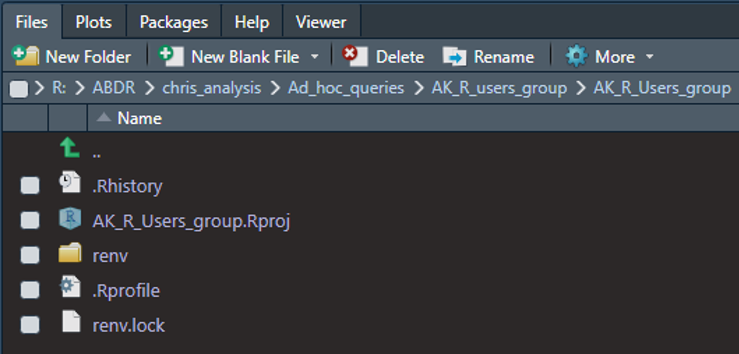

<style type="text/css">
h1.title { /* Header 4 - and the author and date headers use this too  */
  font-size: 40px;
  font-style: normal;
  font-weight: bold;
  font-family: Tahoma, Verdana, sans-serif;
  color: Black;
}

h4.author { /* Header 4 - and the author and date headers use this too  */
  font-size: 20px;
  font-style: normal;
  font-family: Tahoma, Verdana, sans-serif;
  color: Black;

}
h4.date { /* Header 4 - and the author and date headers use this too  */
  font-size: 20px;
  font-family: Tahoma, Verdana, sans-serif;
  color: Black;
}

h2 {/* Header 2 */
  font-size: 24px;
  font-family: Tahoma, Verdana, sans-serif;
  color: Black;
  background-color: WhiteSmoke;
  text-indent: 5px;
}
</style>

---


## What is the *renv* package for?

- The [*renv* package](https://cran.r-project.org/web/packages/*renv*/index.html) helps manage library paths and other project-specific stuff to help isolate your project’s R dependencies.
- The goal is for *renv* to be a robust, stable replacement for the [Packrat package](https://rstudio.github.io/packrat/).

## How Does *renv* Work?

The *renv* package helps make your code more isolated, portable, and reproducible.

**Isolated**: Installing a new or updated package for one project won’t break your other projects, and vice versa. That’s because *renv* gives each project its own private package library.

**Portable**: Easily transport your projects from one computer to another across different platforms. In addition, the *renv* package makes it easy to install the packages your project depends on.

**Reproducible**: The *renv* package records the exact package versions you depend on and ensures those identical versions are the ones that get installed wherever you go.

## Setup
You can setup the *renv* package immediately during the project creation step, or you can initiate the *renv* package for an existing project with the **init()** function.


```r
## install.packages("renv")
## renv::init()
```

## Infrastructure


The *renv* package creates two essential items in your project directory.
  
  - A **renv folder** - The private project library.
  - A **renv.lock file** - The lockfile, describing the state of your project’s library at some point in time.
  
For your first time using *renv*, you must install all utilized packages in your project. However, *renv* maintains a global cache of all packages used in *renv* (for all projects). The global cache saves significant time and disk space as the identical package versions do not need to be re-downloaded and saved for multiple projects.

You can see which packages are currently installed with the **status()** function


Add installed packages versions to your project lockfile with the **snapshot()** function

```r
# renv::snaphot()
```

The *renv* function snapshot() will examine your project’s R files to determine which packages you are using in your project. Then, it will include only those packages (alongside their recursive dependencies) in the lockfile. The *renv* package achieves this by scanning your code for calls to **library()** or **require()**.

## Package Sources
The *renv* package is able to install and restore packages from a variety of sources, including:

- [CRAN](https://cran.r-project.org/)
- [Bioconductor](https://www.bioconductor.org/)
- [GitHub](https://github.com/)
- [Gitlab](https://about.gitlab.com/)
- [Bitbucket](https://bitbucket.org/product)

## Maintaining *renv* Versions
After starting a project with the *renv* package, that project will use the version of *renv* last downloaded. To upgrade the version of *renv* associated with a project, you can use *renv*::upgrade(), which will install the latest available version of *renv* from your package repositories.

## Not a Silver Bullet
The *renv* package is great for managing package dependencies. However, for dependencies outside of packages, *renv* does not maintain version control for other common R dependencies like [Pandoc](https://pandoc.org/), [LaTex](https://www.latex-project.org/), and even something as simple as your version of [R](https://www.r-project.org/about.html), or [RStudio](https://posit.co/products/open-source/rstudio/).

## More Resources on *renv*

[Introduction to *renv* Github Page](https://rstudio.github.io/*renv*/articles/*renv*.html)

[Riffomonas Youtube Channel](https://www.youtube.com/watch?v=yc7ZB4F_dc0)

[Posit PBC Youtube Channel](https://www.youtube.com/watch?v=GwVx_pf2uz4)

[Posit "Time_Travel_R" Webinar](https://posit.co/resources/videos/time-travel-r/)
